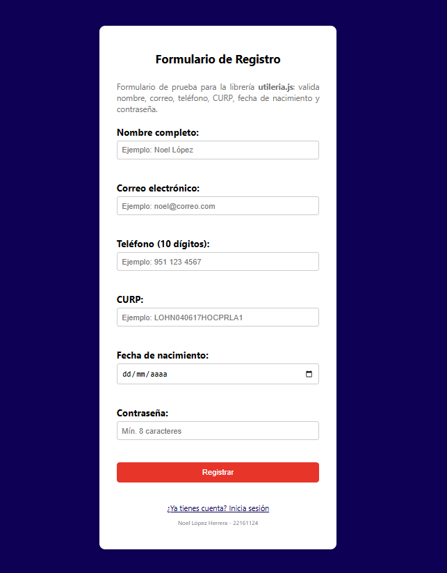

Librería de Validaciones para Formularios - Utilería JS

INSTITUTO TECNOLÓGICO NACIONAL DE MÉXICO
INSTITUTO TECNOLÓGICO DE OAXACA

Ingeniería en Sistemas Computacionales

Programación Web

Librería JavaScript de Utilería para Validaciones

Unidad 2

Alumno:
López Herrera Noel

Docente:
Adelina Martínez Nieto

Grupo:
7SC

Fecha de entrega:
04 de julio del 2026

---

## ¿Qué problema resuelve?

`utileria.js` es una pequeña librería de JavaScript puro, sin dependencias ni frameworks, que agrupa las validaciones de formulario más necesarias en cualquier proyecto web: correo, nombre, contraseña, teléfono, CURP y edad.

Esta idea surge por un problema que aparece en casi todo proyecto: terminas escribiendo el mismo regex de correo, o la misma lógica de tener que revisar que los datos sean siguiendo una misma regla, en cada formulario nuevo que armas. Aquí quedan esas 8 funciones en un solo archivo, documentadas y con ejemplos, para enlazarlas donde se necesiten sin reescribir nada.

El repositorio incluye dos páginas de demostración: un formulario de registro que valida cada campo en tiempo real y muestra un modal con la edad calculada, y un login que valida correo y contraseña.

---

## Instalación

Para usar la librería en tu proyecto, solo incluye el archivo `utileria.js` en tu documento HTML con la etiqueta `<script>`, antes de tu propio script:

```html
<script src="js/utileria.js"></script>
<script src="js/tu-script.js"></script>
```
---

## Uso y Ejemplos

A continuación se muestran ejemplos de cómo utilizar cada una de las funciones incluidas en la librería.

### 1. `validarCorreo(correo)`
Valida que una cadena de texto tenga el formato correcto de un correo electrónico.

```javascript
let correoUsuario = "noel.lopez@email.com";
let esValido = validarCorreo(correoUsuario);

if (esValido) {
    console.log("El correo es válido.");
} else {
    console.log("El correo no es válido.");
}
```

### 2. `soloLetras(texto)`
Valida que el texto ingresado contenga únicamente letras (incluyendo acentos y la letra ñ) y espacios.

```javascript
let nombreUsuario = "Noel López";
if (soloLetras(nombreUsuario)) {
    console.log("El nombre contiene solo letras.");
}
```

### 3. `validarLongitud(numero, maxLongitud)`
Valida que un número no exceda la cantidad máxima de dígitos especificada.

```javascript
let telefono = "9511234567";
if (validarLongitud(telefono, 10)) {
    console.log("Longitud de teléfono correcta.");
}
```

### 4. `calcularEdad(fechaNacimiento)`
Calcula la edad exacta en años a partir de una fecha de nacimiento (formato YYYY-MM-DD).

```javascript
let fechaNac = "2000-05-15";
let edad = calcularEdad(fechaNac);
console.log("La edad es: " + edad + " años.");
```

### 5. `esMayorDeEdad(fechaNacimiento)`
Determina si una persona es mayor de edad (18 años o más) usando su fecha de nacimiento.

```javascript
let fechaNac = "2005-10-20";
if (esMayorDeEdad(fechaNac)) {
    console.log("Es mayor de edad, puede registrarse.");
} else {
    console.log("Aún es menor de edad.");
}
```

### 6. `validarPassword(password)`
Valida que la contraseña cumpla con los siguientes criterios de seguridad:

- Mínimo 8 caracteres.
- Al menos una mayúscula.
- Al menos una minúscula.
- Al menos un número.
- Al menos un carácter especial.

```javascript
let pass = "Segura123!";
if (validarPassword(pass)) {
    console.log("La contraseña es segura.");
}
```

---

## Funciones Adicionales (Propias)

### 7. `validarTelefono(telefono)`
Valida que un número de teléfono mexicano tenga exactamente 10 dígitos, sin importar si el usuario lo escribió con espacios, guiones o paréntesis. Esto resuelve un problema común: los usuarios rara vez escriben su teléfono en un formato limpio, y esta función limpia el texto antes de contar los dígitos.

```javascript
console.log(validarTelefono("951 123 4567"));   // true
console.log(validarTelefono("(951) 123-4567")); // true
console.log(validarTelefono("12345"));          // false
```

### 8. `validarCURP(curp)`
Valida que una CURP mexicana tenga el formato oficial de 18 caracteres (4 letras, 6 dígitos de fecha de nacimiento, letra de sexo, clave de entidad, 3 consonantes y 2 caracteres de verificación). Está pensada para sistemas escolares — como PACAYAT, un proyecto en el que también he trabajado — donde se inscribe a estudiantes y se les pide la CURP como identificador oficial.

```javascript
console.log(validarCURP("LOHN040822HOCPRLA3")); // true
console.log(validarCURP("LOHN040822HOCPRLA3"));  // false (formato incompleto)
```

---

## Integración en el proyecto

- **`index.html`** — Formulario de registro que usa `soloLetras`, `validarCorreo`, `validarTelefonoMX`, `validarCURP`, `esMayorDeEdad` y `validarPassword`. Al enviarse correctamente, abre una **ventana modal** que muestra la edad calculada con `calcularEdad`.
- **`login.html`** — Formulario de login que usa `validarCorreo` y `validarPassword` para validar los campos antes de iniciar sesión.

---

## Pruebas en consola

Al abrir `index.html` o `login.html` en el navegador y presionar F12 para abrir la consola, se pueden ver los resultados de cada validación mediante `console.log()`: tanto los casos donde el formulario se registra o inicia sesión exitosamente, como los casos donde algún campo falla y se detiene el envío.

---

## Capturas de Pantalla




---

## Video Demostrativo

Ver Video: https://youtu.be/fX-0l3-RHp4

---

## Enlace a GitHub Pages

Puedes acceder a los formularios funcionando en vivo con las validaciones de esta librería en el siguiente enlace:

Ver Repositorio: https://github.com/Sonnx18/Utileria.js.git

Ver Página en Vivo - GitHub Pages: _(pega aquí el link de GitHub Pages)_
